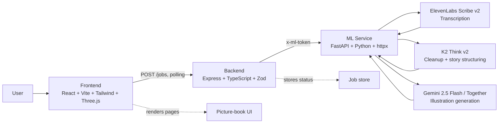

# DreamsComeTrue

> Speak a story. Watch it become a picture book.

[](https://hackprinceton.com)
[](https://github.com/Ananya-Jha-code/DreamsComeTrue)
[](https://k2think.ai)
[](https://deepmind.google/gemini)
[](https://elevenlabs.io)

DreamsComeTrue turns a spoken story into a multi-page illustrated picture book. You choose a visual style, reading level, and tone before you record. The app transcribes the audio, cleans and structures the story, and generates page illustrations that arrive progressively in the UI.

## Overview

The app is split into three services:

- Frontend: React, Vite, Tailwind CSS, Three.js
- Backend: Express, TypeScript, Zod
- ML service: FastAPI, Python, httpx

The backend handles jobs and orchestration. The ML service handles transcription, story cleanup, and illustration generation. The frontend polls the backend for job updates so pages can appear as they are ready.

## Architecture Diagram



The frontend sends audio and filter choices to the backend. The backend creates and tracks jobs, then asks the ML service to transcribe, clean, and illustrate the story. The ML service calls the external AI providers and returns structured results that the frontend can render page by page.

## Pipeline

1. Record voice in the browser.
2. Send the audio to ElevenLabs Scribe v2 for transcription.
3. Use K2 Think v2 to clean the transcript, choose a title, and split the story into picture-book pages.
4. Use Gemini 2.5 Flash to generate one illustration per page.
5. Stream the finished pages back into the book view.

## Why It Is Split This Way

The ML service keeps provider API keys out of the frontend. The backend and ML service authenticate with a shared token, so provider changes stay isolated from the UI.

The job flow is asynchronous because image generation takes time. The backend responds quickly and the frontend refreshes the job record until the full book is ready.

## Repository Layout

```text
.
├── backend/        Express API and job pipeline
├── frontend/       React app and UI
├── ml-service/     FastAPI transcription and generation service
├── DEPLOYMENT.md   Deployment guidance
└── README.md       Project overview and setup
```

## Requirements

- Node.js 20+
- Python 3.12+
- API keys for ElevenLabs, Google AI, and K2 Think

## Install Dependencies

From the repository root:

```bash
npm install
py -3.12 -m pip install -r ml-service/requirements.txt
```

## Run Locally

### Option 1: Run everything together

```bash
npm run dev:full
```

This starts the frontend, backend, and ML service together. The ML service uses:

```bash
py -3.12 -m uvicorn main:app --reload --port 8000 --app-dir ml-service
```

### Option 2: Run each service separately

Backend:

```bash
cd backend
cp .env.example .env
npm run dev
```

Frontend:

```bash
cd frontend
npm run dev
```

ML service:

```bash
cd ml-service
cp .env.example .env
py -3.12 -m uvicorn main:app --reload --port 8000
```

Open `http://localhost:5173` in your browser.

## Environment Variables

### `ml-service/.env`

```env
ELEVENLABS_API_KEY=
ELEVENLABS_STT_MODEL=scribe_v2
ELEVENLABS_STT_URL=https://api.elevenlabs.io/v1/speech-to-text
TOGETHER_API_KEY=
K2THINK_API_KEY=
K2_BASE_URL=https://api.k2think.ai/v1
K2_CLEANUP_MODEL=MBZUAI-IFM/K2-Think-v2
K2_TEMPERATURE=0.3
FLUX_MODEL=black-forest-labs/FLUX.2-pro
FLUX_TIMEOUT_SECONDS=120
ML_SERVICE_TOKEN=dev-token
```

### `backend/.env`

```env
ML_SERVICE_URL=http://localhost:8000
ML_SERVICE_TOKEN=dev-token
PORT=3001
```

## npm Scripts

Root workspace:

```bash
npm run dev
npm run dev:full
npm run build
```

Frontend workspace:

```bash
npm run dev -w frontend
npm run build -w frontend
npm run preview -w frontend
```

Backend workspace:

```bash
npm run dev -w backend
npm run build -w backend
npm run start -w backend
```

## Deployment Notes

- Frontend: Vercel
- Backend and ML service: Fly.io or Modal
- Keep the ML service behind an internal token and do not expose provider keys in the browser

See [DEPLOYMENT.md](DEPLOYMENT.md) for the deployment plan.

## What Makes It Different

Most AI storytelling tools ask you to type. This one starts with speech.

Most pipelines treat the LLM as a formatter. DreamsComeTrue uses K2 Think v2 as a co-author that shapes the transcript into a real picture book.

Most image generation demos create disconnected images. This one pushes full story context into each illustration prompt so the book feels continuous.

The result is not just generated content. It is a book.

## License

See [LICENSE](LICENSE) for details.
