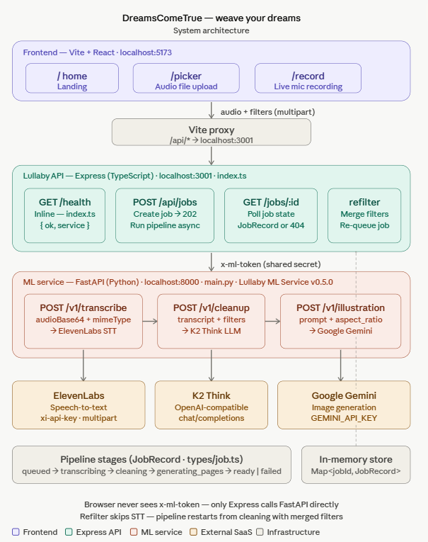

# DreamsComeTrue 

**HackPrinceton 2026 submission** — *Weave your dreams.*

Web app scaffold for the PRD pipeline: spoken story → narrated illustrated picture book.

Turn spoken stories into a **narrated illustrated picture book**: upload or record audio, choose visual style / reading level / tone, **K2 Think V2** reasoning and get page-by-page text plus **Gemini** illustrations driven by your transcript.



---

## What this project does

1. **Frontend (Vite + React)** — Routes: `/` (landing), `/picker` (file upload), `/record` (microphone). The dev server proxies `/api/*` to the Express API on port **3001**.
2. **Backend (Express, TypeScript)** — Accepts multipart uploads (`audio` + optional `filters`), creates a **job**, returns **202 Accepted** immediately, and runs an async pipeline. The client polls `GET /api/jobs/:id` for status and results.
3. **ML service (FastAPI, Python)** — Internal-only gateway (not called from the browser). It transcribes audio (**ElevenLabs** STT), cleans and structures the story (**K2 Think** via OpenAI-compatible chat completions), and generates images (**Together** — FLUX.1-schnell by default).

Job stages are: `queued` → `transcribing` → `cleaning` → `generating_pages` → `ready` (or `failed`). Job state is stored **in memory** (`Map`) for the demo; restarting the backend clears jobs.

---

## Required Stack (Strict)

| Layer | Technology |
|---|---|
| Frontend | React + Vite + Tailwind CSS |
| Backend | Node.js + Express + FastAPI (ML calls) |
| Transcription | Eleven Labs |
| Cleanup / Planning / Rewrite | K2 Think primary, Gemini 2.5 Pro fallback |
| Image generation | Gemini for page illustrations |
| Narration audio | Gemini 2.5 native multimodal TTS |
| Ambient audio | Gemini 2.5 multimodal audio |
| Assembly | Page-by-page image composition |
| Storage | Supabase (session cache + temporary image hosting) |
| Deployment | Digital Ocean |

---

## Architecture and performance

- **Asynchronous jobs** — `POST /api/jobs` responds with **202** and a `jobId` while heavy work runs in the background, so the UI stays responsive.
- **Progressive results** — As each illustrated page completes, the backend updates the job record so polling can show pages as they arrive (not only at the very end).
- **Isolated ML API** — The browser talks only to Express. The FastAPI service requires a shared **`x-ml-token`** header; provider keys stay on the server.
- **Direct provider adapters** — STT, LLM cleanup, and image generation are implemented as straightforward HTTP calls from the ML service to ElevenLabs, K2 Think, and Together (see diagram above).

---

## Repository Structure

| Path | Purpose |
|---|---|
| `frontend/` | React + Vite + Tailwind UI |
| `backend/` | Express public API, job orchestration |
| `ml-service/` | FastAPI internal ML gateway (ElevenLabs STT / K2 / FLUX adapters) |
| `docs/` | Architecture diagram and other assets |

---

## Service Boundaries

- Express (`backend`) is the public app API: receives uploads, tracks jobs, calls internal ML service, and handles orchestration and eventual FFmpeg + Supabase.
- FastAPI (`ml-service`) is internal-only ML gateway:
  - `/v1/transcribe` (ElevenLabs speech-to-text)
  - `/v1/cleanup` (K2 Think paragraph planning)
  - `/v1/illustration` (FLUX page art via Together)

---

## APIs (Express)

- `GET /api/health`
- `POST /api/jobs` (multipart: `audio`, optional `filters` JSON string) — returns **202** `{ jobId, stage }`
- `GET /api/jobs/:id`
- `POST /api/jobs/:id/refilter`

### API summary (tables)

| Method | Path | Description |
|--------|------|-------------|
| `GET` | `/api/health` | Liveness: `{ ok, service }` |
| `POST` | `/api/jobs` | Multipart: field **`audio`** (required), optional **`filters`** (JSON string). Returns **202** `{ jobId, stage }`. |
| `GET` | `/api/jobs/:id` | Full job record or **404** |
| `POST` | `/api/jobs/:id/refilter` | JSON `{ filters: { ...partial } }` — merges filters and re-queues the pipeline (**202**). |

**ML service (internal, called by Express only)**

| Method | Path | Purpose |
|--------|------|---------|
| `GET` | `/health` | ML service liveness |
| `POST` | `/v1/transcribe` | `audioBase64` + `mimeType` → ElevenLabs STT |
| `POST` | `/v1/cleanup` | Transcript + `filters` → K2 cleanup / paragraph planning |
| `POST` | `/v1/illustration` | `prompt` + `aspect_ratio` → Gemini |

All `/v1/*` routes expect header **`x-ml-token`** matching `ML_SERVICE_TOKEN`.

---

## Environment

- Copy `backend/.env.example` → `backend/.env`
- Copy `ml-service/.env.example` → `ml-service/.env`
- Put your ElevenLabs API key in `ml-service/.env` as `ELEVENLABS_API_KEY=...`
- Never commit real keys.

For the current transcription flow, `ELEVENLABS_API_KEY` is the primary ML service secret for STT. `K2THINK_API_KEY` (or `K2_API_KEY`) enables paragraph planning and `TOGETHER_API_KEY` enables FLUX illustration generation.

### `backend/.env` (from `backend/.env.example`)

| Variable | Purpose |
|----------|---------|
| `PORT` | API port (default **3001**) |
| `FRONTEND_ORIGIN` | CORS origin (default `http://localhost:5173`) |
| `ML_SERVICE_URL` | FastAPI base URL (default `http://localhost:8000`) |
| `ML_SERVICE_TOKEN` | Must match `ml-service` `ML_SERVICE_TOKEN` |

### `ml-service/.env` (from `ml-service/.env.example`)

| Variable | Required for | Notes |
|----------|----------------|-------|
| `ML_SERVICE_TOKEN` | Securing `/v1/*` | Same value as backend `ML_SERVICE_TOKEN` |
| `ELEVENLABS_API_KEY` | Speech-to-text | `xi-api-key` for ElevenLabs STT |
| `ELEVENLABS_STT_MODEL` | STT | e.g. `scribe_v2` |
| `ELEVENLABS_STT_URL` | STT | Default ElevenLabs speech-to-text URL |
| `K2THINK_API_KEY` (or `K2_API_KEY`) | Story cleanup / planning | OpenAI-compatible Bearer token |
| `K2_BASE_URL` | K2 client | Default `https://api.k2think.ai/v1` |
| `K2_CLEANUP_MODEL` | Cleanup | e.g. `MBZUAI-IFM/K2-Think-v2` |
| `Gemini` | Images | Gemini |

---

## Local Setup

```bash
cd HackPrinceton
npm install
```

Install Python deps for FastAPI with Python 3.12:

```bash
py -3.12 -m pip install -r ml-service/requirements.txt
```

Run frontend + express:

```bash
npm run dev
```

Run the full local stack with one command:

```bash
npm run dev:full
```

`dev:full` starts the frontend, backend, and ML service together. It uses Python 3.12 for the ML service so the FastAPI dependencies install and run correctly on Windows.

**Prerequisites for a working demo:** Node.js (npm workspaces), **Python 3.12**, and the API keys in `ml-service/.env` (plus matching `ML_SERVICE_TOKEN` in `backend/.env`).

Copy env files (PowerShell):

```powershell
copy backend\.env.example backend\.env
copy ml-service\.env.example ml-service\.env
```

Or on macOS/Linux:

```bash
cp backend/.env.example backend/.env
cp ml-service/.env.example ml-service/.env
```

Edit `backend/.env` and `ml-service/.env` with your keys and tokens.

**Note:** `npm run dev` runs frontend + Express only; the ML service must be running separately (e.g. another terminal) unless you use `npm run dev:full`.

Services when running locally:

- Frontend: `http://localhost:5173`
- Backend health: `http://localhost:3001/api/health`
- ML service health: `http://localhost:8000/health`

---

## Docker Setup

Run the full stack with Docker (no local Node/Python dependency install required):

```bash
docker compose up --build -d
```

Before running, set `ELEVENLABS_API_KEY` in your shell so `docker-compose.yml` can pass it to `ml-service`.

PowerShell:

```powershell
$env:ELEVENLABS_API_KEY="your_key_here"
docker compose up --build -d
```

Services:

- Frontend: `http://localhost:5173`
- Backend health: `http://localhost:3001/api/health`
- ML service health: `http://localhost:8000/health`

Stop containers:

```bash
docker compose down
```

---

## Build

```bash
npm run build
```

Outputs `frontend/dist` and `backend/dist`.

---

## Important Note

Current ML / FFmpeg / Supabase logic is scaffold-level and intentionally stubbed in places, but the architecture and provider boundaries for the **picture-book workflow** (STT → K2 cleanup → FLUX pages) match the pipeline described above. Items in **Required Stack** such as Gemini TTS, ambient audio, Supabase storage, and deployment targets are part of the PRD implemented in this repository yet.

---

## Credits

Submitted to **HackPrinceton 2026**. Project codename **Lullaby**; product name **DreamsComeTrue**.
