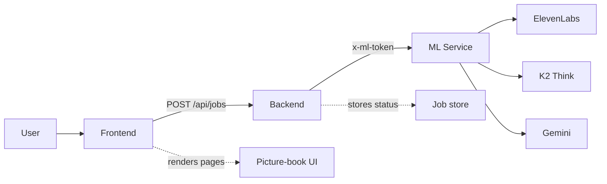

# DreamsComeTrue

> Speak a story. Watch it become a picture book.

[](https://hackprinceton.com)
[](https://github.com/Ananya-Jha-code/DreamsComeTrue)
[](https://k2think.ai)
[](https://ai.google.dev/gemini)
[](https://elevenlabs.io)

DreamsComeTrue turns a spoken story into a multi-page illustrated picture book. You pick a visual style, reading level, and tone, record your story, and the app transcribes, cleans, structures, and illustrates it page by page.

## What It Does

- Records a story in the browser and sends the audio to the backend.
- Transcribes speech with ElevenLabs Scribe v2.
- Uses K2 Think v2 to clean the transcript and shape it into picture-book pages.
- Generates one illustration per page with Gemini.
- Streams job progress back to the UI so pages appear as they are ready.

## Project Structure

```text
.
├── backend/        Express API, job store, and orchestration pipeline
├── frontend/       React + Vite storybook UI
├── ml-service/     FastAPI service for transcription, cleanup, and image generation
├── DEPLOYMENT.md   Deployment plan
└── render.yaml     Render Blueprint for backend and ML service
```

## Architecture



The frontend posts audio and filter choices to the backend. The backend creates a job, tracks its state, and calls the ML service. The ML service keeps provider credentials out of the browser and returns structured results that the UI can render incrementally.

## Local Setup

Requirements:

- Node.js 20+
- Python 3.12+
- API keys for ElevenLabs, K2 Think, and Together

Install dependencies from the repository root:

```bash
npm install
py -3.12 -m pip install -r ml-service/requirements.txt
```

Create a root `.env` file with the values below.

## Run Locally

Run all services together:

```bash
npm run dev:full
```

Run the frontend and backend only:

```bash
npm run dev
```

Run each service separately if you need to debug one piece at a time:

```bash
npm run dev -w backend
npm run dev -w frontend
py -3.12 -m uvicorn main:app --reload --port 8000 --app-dir ml-service
```

The Vite dev server proxies `/api` to `http://localhost:3001`, so the frontend works with the backend without extra client configuration.

Open `http://localhost:5173` after the frontend starts.

## Environment Variables

### Root `.env`

```env
PORT=3001
FRONTEND_ORIGIN=http://localhost:5173
ML_SERVICE_URL=http://localhost:8000
ML_SERVICE_TOKEN=dev-token

ELEVENLABS_API_KEY=
ELEVENLABS_STT_MODEL=scribe_v2
ELEVENLABS_STT_URL=https://api.elevenlabs.io/v1/speech-to-text

K2THINK_API_KEY=
K2_BASE_URL=https://api.k2think.ai/v1
K2_CLEANUP_MODEL=MBZUAI-IFM/K2-Think-v2
K2_MODEL=MBZUAI-IFM/K2-Think-v2
K2_TIMEOUT_SECONDS=120
K2_TEMPERATURE=0.3
K2_JSON_MODE=0

TOGETHER_API_KEY=
FLUX_MODEL=black-forest-labs/FLUX.2-pro
FLUX_TIMEOUT_SECONDS=120
```

## npm Scripts

Root workspace:

```bash
npm run dev
npm run dev:full
npm run build
```

Frontend workspace:

```bash
npm run dev -w frontend
npm run build -w frontend
npm run preview -w frontend
```

Backend workspace:

```bash
npm run dev -w backend
npm run build -w backend
npm run start -w backend
```

## Deployment

- Frontend: Vercel
- Backend and ML service: Render
- Use `render.yaml` at the repository root for the Render Blueprint
- Keep `ML_SERVICE_TOKEN` identical in both backend and ML service environments
- Do not expose provider API keys to the browser

Suggested deployment wiring:

1. Deploy the Render Blueprint from `render.yaml`.
2. Set backend `ML_SERVICE_URL` to the Render ML service URL.
3. Set backend `ML_SERVICE_TOKEN` and ML service `ML_SERVICE_TOKEN` to the same shared secret.
4. Set backend `FRONTEND_ORIGIN` to your Vercel domain.
5. Set `VITE_API_BASE_URL` in Vercel to your backend Render URL.

The frontend API client uses `VITE_API_BASE_URL` when it is set and falls back to relative `/api` paths for local dev and proxy setups.

See [DEPLOYMENT.md](DEPLOYMENT.md) for the full deployment plan.

## Why It Is Split This Way

The ML service keeps provider keys isolated from the frontend. The backend and ML service authenticate with a shared token, which lets orchestration stay separate from UI concerns.

The job flow is asynchronous because transcription and image generation take time. The backend responds quickly, and the frontend polls for updates until the full book is ready.

## License

See [LICENSE](LICENSE) for details.
